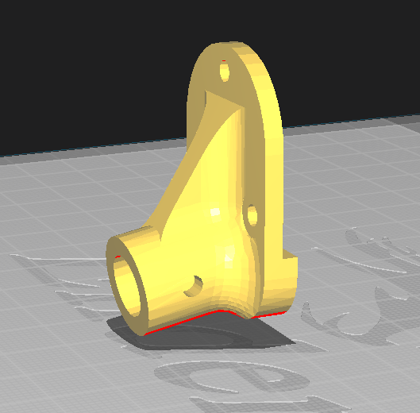

- AVR-LANDING-GEAR-MOUNT (x4)
  - STL file:
    [AVR-LANDING-GEAR-MOUNT.stl](https://cad.onshape.com/documents/3111e54b1b04514aeae7a864/w/143325ef8d6ebdd537b470ee/e/b22e3b7065b1cd4f7302c1af?renderMode=0&uiState=6306944891cbbe0c90ef6159)
  - STEP file:
    [AVR-LANDING-GEAR-MOUNT.stp](https://cad.onshape.com/documents/fa003edf875e5b2872904249/w/19f57e1552f34fc165774c35/e/ad10644669e5451a597cee1b)
- AVR-LANDING-GEAR-BRACE (x4)
  - STL file:
    [AVR-LANDING-GEAR-BRACE.stl](https://cad.onshape.com/documents/485005cf8f758e5c698effb5/w/bd4c6d9668037e376ceb49f9/e/550aecfaa6c26cb1a344f6df)
    (This one needs to be exported as "inches" to import correctly)
  - STEP file:
    [AVR-LANDING-GEAR-BRACE.stp](https://cad.onshape.com/documents/129bfa2356bc354a6be7862a)
- AVR-LANDING-GEAR-FOOT (x4)
  - STL file:
    [AVR-LANDING-GEAR-FOOT.stl](https://cad.onshape.com/documents/76aba847b994f374e2738b88)
  - STEP file:
    [AVR-LANDING-GEAR-FOOT.stp](https://cad.onshape.com/documents/4e2a1a3e0036de025ce1eee8)

{} For the landing gear it is highly advised that
you print with 100% infill as these are going to be parts that will need to withstand
the impact of landing.

Additionally, you should print the mounts vertically for increased strength. This puts
the layers perpendicular to most of the forces applied rather than parallel.

 {}
