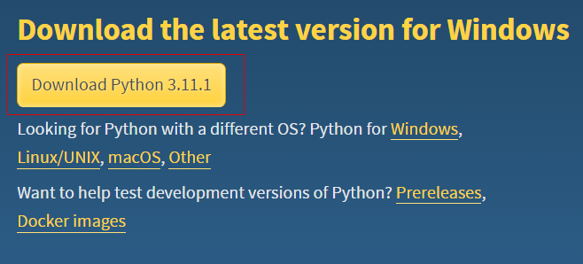
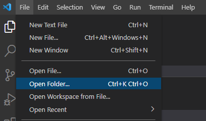
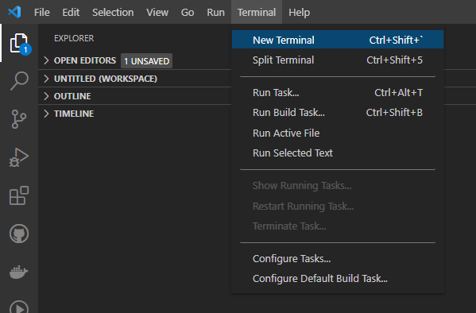

Python is a general purpose programming language. Being one of the most popular
programming languages in the world, Python is known for readability and accessability.
This section will walk you through installing Python and testing it on your machine.

## VS Code Extension

Before we get started, make sure you have the Visual Studio Code extension for Python.
Go to your extensions tab, search "Python", and install.


This extension allows for debugging, auto-complete, and Python environment management in
VS Code.

## Python Interpreter

An interpreter's job is to take the high-level code written by your team in VS code and
to translate it into machine language that is executed by your computer.

The Python interpreter is best installed from Python.org. Go to the
[downloads](https://www.python.org/downloads/) page, and select the latest version for
your operating system.



To confirm your installation, open a command prompt window and execute the following
command:

```bash
py -3 --version
```

If your installation was successful, the output window will show the version of Python
you have installed.

## Setting Up a Project

Let's set up a central location to store your future projects. Start by creating a
"Projects" folder somewhere on your PC. Within this folder, make a "Hello World" folder.
This is where we will create your first project.

In a blank VS Code window, open up this folder:



In your new workspace, create a new file called "hello.py". The ".py" file format
denotes a script written in python.

In this file, type the following:

```python
print("Hello World")
```

Congrats, you've written your first python script! Before we run it, we will need to set
up a python environment.

## Setting Up a Python Environment

An "environment" is the context in which the python program runs. It consists of an
interpreter and installed packages. We will be using "virtual environments". These are
are environments that are project specific and stored within the project itself. To
create one in your "Hello World" project, start up a terminal.



In this terminal, type the following to create the virtual environment folder in your
project:

```python
py -3 -m venv .venv
```

To activate the environment:

```python
.venv\scripts\activate
```

The environment should now be activated. You're now set up to run your script. In the
terminal, type and execute:

```python
py Hello.py
```

If you were successful, you should see "Hello World" printed in the console.
