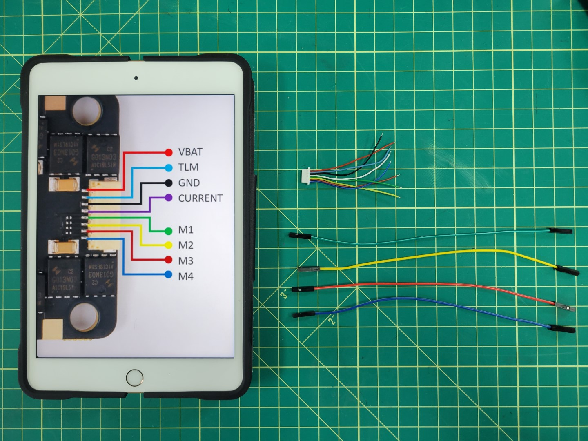
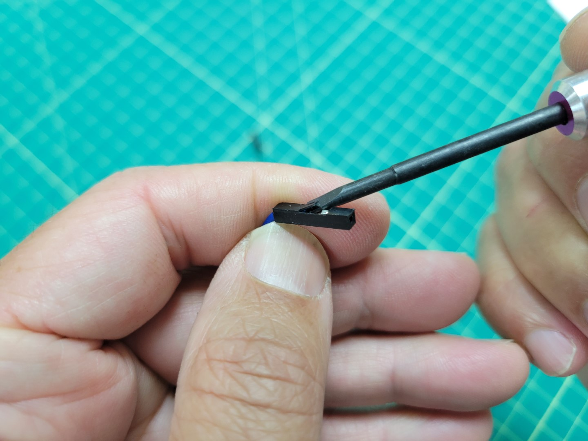
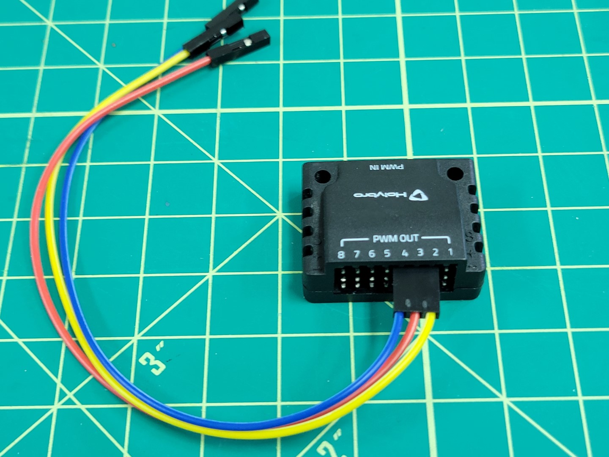
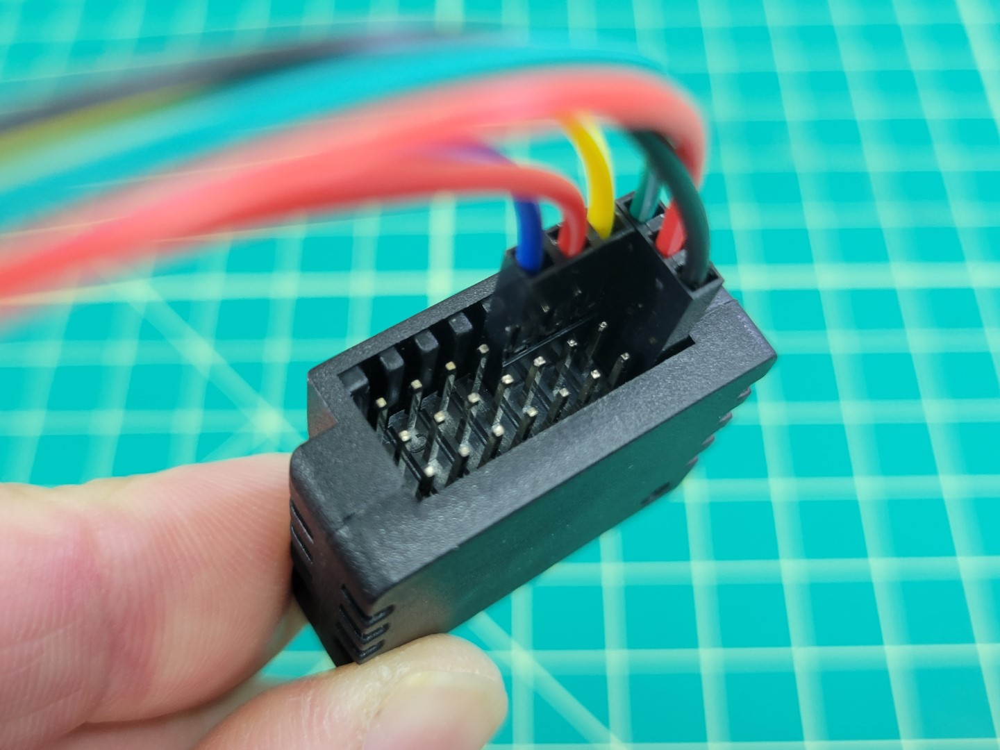
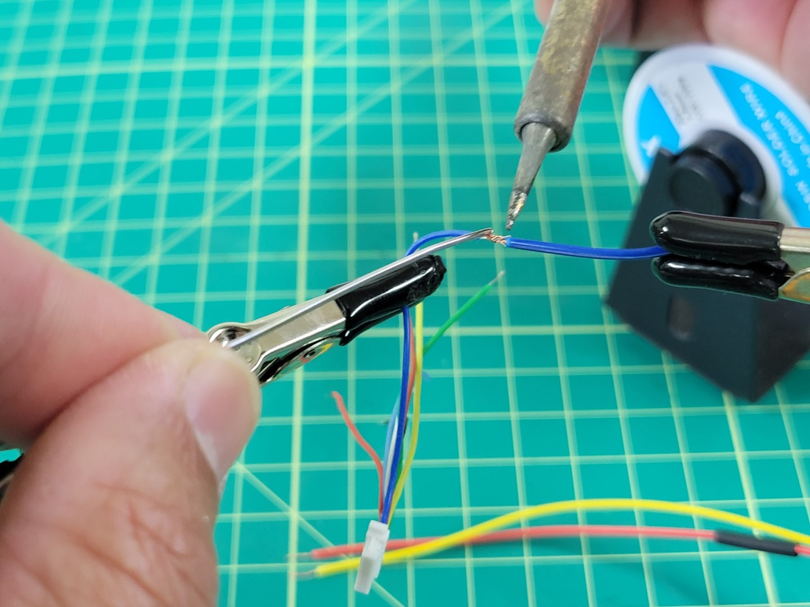
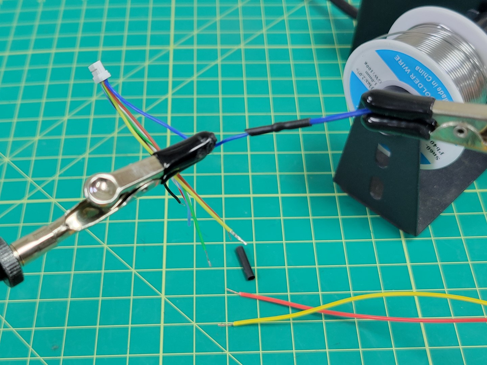
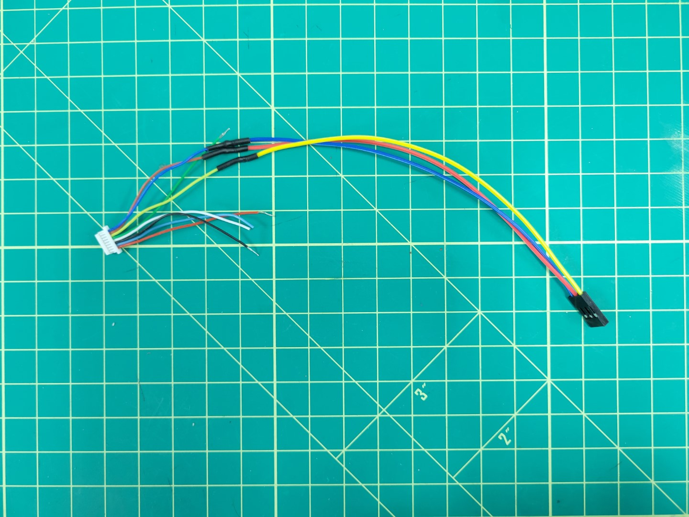
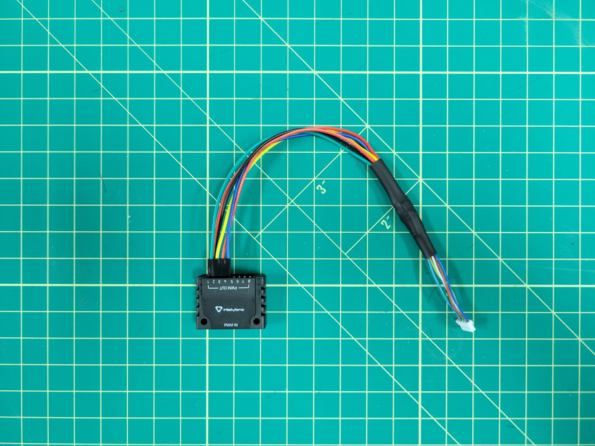
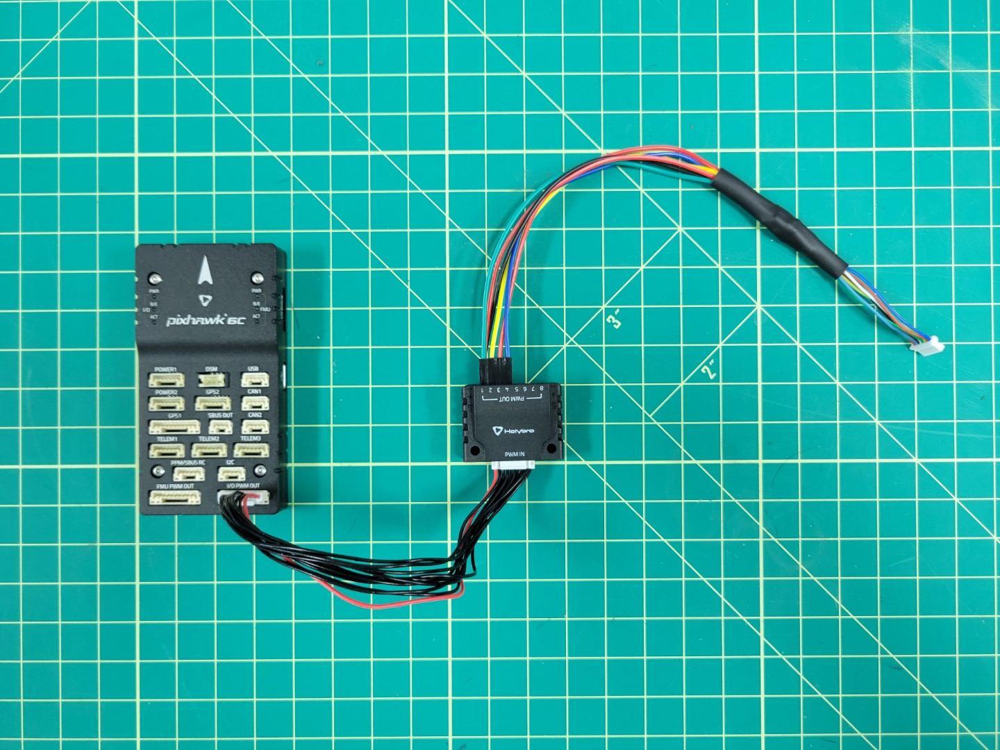

## FC Wiring

{} This section of the build requires some
additional tools not included in your AVR kit such as a soldering iron, heat shrink
tubing, wire strippers, and a hobby knife. {}

You may have noticed that the ESC has a connector with several flying leads coming out
of it. These leads are what we will be connecting to the FC. The FC will send PWM
([Pulse Width Modulation](https://en.wikipedia.org/wiki/Pulse-width_modulation)) signals
to each of the motors to keep the AVR drone hovering in the air.

Remove the small white cable adapter from the ESC and gather the necessary parts for
this phase of the build as seen in the photo below.

The image below shows the pinout for the ESC connector. We will be focused on wiring
each of the motor leads **(M1-M4)** as well as **VBAT** and **GND** to the PWM module of
the FC. We will not be using **TLM** or **CURRENT**.

{} Each of the leads has a small amount of
wire exposed. Go ahead and clip off the exposed wire of the **TLM** and **CURRENT**
leads. {}

Pull out four jumper cables from your AVR kit and to keep things simple make sure they
mach up with each of the motor wire colors. They will be green (M1), yellow (M2), red
(M3), and blue (M4) as seen in the image below.

Remove the plastic female connector from one end of each jumper cable. This is easy to
do once you understand how the connector works. There is a small tab that you can pry up
and then slide the cable out. A small flat head screwdriver or tweezers area great tools
to assist with this step.

Slide the wire all the way out and get rid of the plastic connector.

Slide the wire into the servo connector housing as shown in the photo below. Servo
connectors can be found in a small envelope of miscellaneous parts in your kit. Refer
back to the first photo in this section to see it.

{} Make sure that you listen for a click sound when
sliding the wire into the servo connector. Pay attention to the orientation of the wire
in the photo below. When the wire is secure you can lightly pull on it and it will not
come out. {}

The blue wire is now secured into the connector and represents motor #4 (M4).

We will repeat this step for M2 (yellow wire) and M3 (red wire).

{} Motor order is incredibly important! Pay
close attention to make sure your wire colors correspond with the correct motors.
{}

The photo below shows how the cable will be attached to the PWM module from the Pixhawk.
You will notice that the connector is plugged in horizontally across the top row of pins
2, 3, and 4. Pixhawk can support up to 8 motors (an octocopter) and each number
represents a specific motor.

{} If you look closely at the PWM module you will see
S, +, - labeled on the right side. This means the top row of pins are SIGNAL pins, the
middle are POWER pins, and the bottom are GROUND pins. {}

Let's repeat the same process for **M1** (green), **VBAT** (red), and **GND** (black).
You will remove each of the plastic female connectors and secure the wires into the
servo connector.

Once again, pay attention to the ordering of your wires. Your second cable should look
identical to the one below.

Make sure your cables are plugged into the PWM module as shown below.

Here is a close up of the connections. This represents the FC side of the wiring. Now we
will proceed with the ESC side.

## ESC Wiring

Go ahead and unplug your cables from the PWM module. Let's take one last look at the ESC
side connections before we solder.

Use wire cutters to cut off the plastic female connectors from the other end of the
colored leads. Proceed with stripping off about 1/2" of the wire insulation.

Remove about 1/2" of insulation from the ESC leads. You will notice that the ESC leads
already have some wire exposed.

{} The ESC leads are very thin. We have found it
easiest to pinch with your fingernails and pull the insulation away. Use caution as you
do not a lot of spare wire on the ESC side! {}

Match up the wire color on the FC side with the same color on the ESC side. Twist the
wires together using the "Twisted Helix" method described in the video below.

<!-- cspell:disable -->



<!-- cspell:enable -->

{} Don't forget to add heat shrink tubing
before twisting your wires together! The heat shrink will be necessary to keep the
connections from shorting after you solder. {}

The photo below shows the blue M4 wire from the ESC connected to the M4 wire of the FC.
The wires are secured using the "Twisted Helix" method.

{} A helping hands device makes the soldering process
100x easier. Whatever method you use take care not to pierce the insulation of the
wires. You can see in the photo below our alligator clips are covered with rubber
shields. {}

Place solder all around the joint to strengthen the connection.

A little solder will go a long way. Don't overdo it as you will need to slide the heat
shrink over the joint next.

Slide the heat shrink over the connection and apply heat to it using a heat gun or a
lighter.

Repeat this process for the **M2** (yellow) and **M3** (red) wires.

{} Red wire was used for both **M3** and
**VBAT**. Make sure not to get these wires mixed up! {}

Repeat the soldering process for **M1** (green), **VBAT** (red), and **GND** (black).
Your new cable should look like the photo below.

{} One last reminder to make sure you clip
the exposed leads from the **TLM** and **CURRENT** wires. {}

Feel free to apply heat shrink over all your wires to keep things clean. If you don't
have heat shrink you can use electrical tape.

Plug your connectors into the Pixhawk PWM module as shown in the photo below.

In the bag of cables that came with your Pixhawk FC look for the 10 pin connector that
attaches to the Pixhawk's **I/O PWM OUT** port and the **PWM IN** port on the PWM
module.

