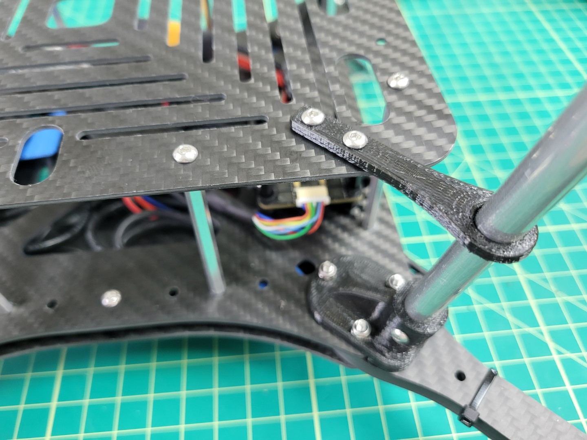
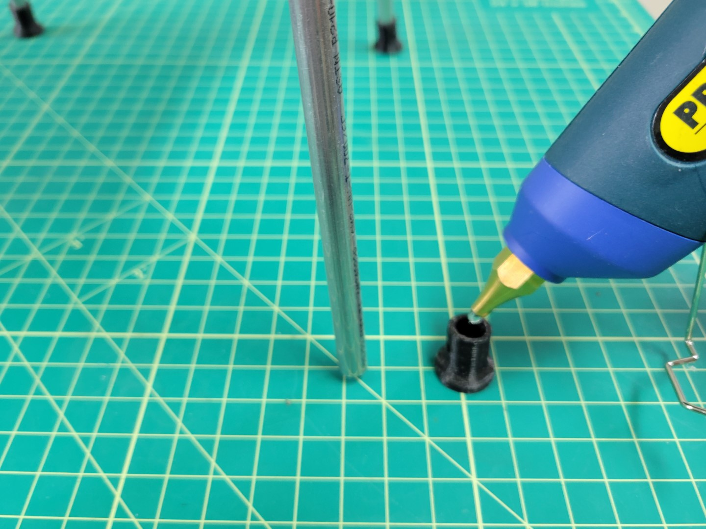

## Landing Gear Drilling and Mounting

{}
To proceed with this step you must have 3D printed the landing gear brace and foot (x4).
{}

Your AVR kit ships with 4 x 9" aluminum rods that are used for landing gear. As you get further into the advanced part of the build you can shorten these rods with a metal hacksaw. Customization is largely dependent on what accessories you have mounted to your drone.

Attaching the aluminum rods to the landing gear mounts will require drilling holes in each rod. We will walk through this process in detail to ensure success and minimize frustration. You will need a drill, 1/16" bit, 1/8" bit, screw (or nail), and a Sharpie.

The first thing you will need to do is place an aluminum rod into the landing gear mount as shown below. In most cases this will be a tight fit so we recommend using a bit of force and rotating the rod clockwise and counterclockwise. This will cause some of the plastic from inside the mount to wear away.

In the photo below you can see some of the plastic shaved off inside the mount.

Repeat this process until the rod is flush with the bottom of the mount.

{}
Use caution as you rotate the rod into the mount. Only use a force perpendicular to the mount. You don't want to run the risk of cracking the mount and having to print and install a new one.
{}

{}
If you find this process cumbersome you can try to use a 3/8" drill bit to hollow out the mount. Once again, use caution to prevent the mount from cracking.
{}

Use a Sharpie to mark a hole on one side of the rod. Do not mark both sides. **There is little margin for error so we will drill one side and repeat this process for the other.**

It can be challenging to accurately drill a hole in the aluminum rod. Clamp the rod to a piece of wood and then place a screw or nail in the center of the Sharpie mark. Tap the screw several times with a hammer to create an indentation in the metal.

Use the 1/16" bit to drill a starter hole. The indentation you created will keep the bit from slipping around. This drill bit is very fragile so don't use too much force.

Now use the 1/8" drill bit to enlarge the hole. This will be the final size necessary for our M3 22mm screws.

Place the rod back into the mount make sure it's all the way in. Slide a 22mm screw through the mount and into the hole you just drilled. Make sure everything fits well and then mark the other side with your Sharpie.

Repeat the tapping and drilling process for the other side of the rod. Once that's complete place the rod back into the mount, slide the 22mm screw all the way through, and secure the rod with a lock nut.

Once all four rods are mounted we will proceed to attaching the landing gear braces which provide extra support.

## Landing Gear Brace Mounting

The landing brace provides additional support by securing the rod to the bottom accessory plate. Use two 8mm screws and lock nuts as shown in the photos below. Repeat this process for all four legs.

## Landing Gear Foot Mounting

There's a good chance that the feet of the landing gear will require press fitting onto the rod. You can use a 3/8" drill bit to shave some of the plastic from the foot.

{}
The foot has a slight angle to it. Be sure to rotate it so the bottom of the foot is flush with the floor.
{}

If the foot is loose feel free to use a drop of hot glue to hold it in place.

Repeat the process for all four feet.

{}
You have completed the first part of the build process! Let's move to the next section to gain a solid understanding of battery management.
{}
