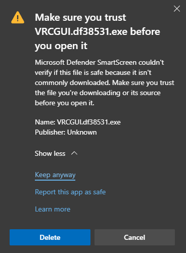

## Physical Setup

On your PCC, we'll need to make use of a USB power jumper to power the servos from our
laptop.


{} MAKE SURE to **ONLY** use the jumper when
testing with your laptop. **NEVER** use the USB power jumper when the PCC is connected
to the Jetson. This is because the servos may draw enough current in certain scenarios
that would cause the current protection to trip on the power supply and power off the
Jetson regardless of what it's doing. {}


Plug your servos and LED strip into the designated connections on the PCC:

- The LED strip plugs into the prop-maker featherwing
- The servos plug into channels 0-3, with the yellow signal wire of the servo facing the
  Adafruit logo on the PCB.

## Software Setup

Now it's time to download the AVR GUI program.

### Windows

Go to the latest
[AVR software release](https://github.com/nathanvaughn/AVR-GUI/releases/latest) and
download the `AVRGUI.<hash>.exe` file. Like QGroundControl, you may need to bypass some
warnings about being an untrusted file.




### Other Platforms

For Linux and MacOS, we recommend running the AVR GUI from source. You'll need to have
Python 3.9 or newer installed.

For Linux users, here's how you can easily install Python 3.11:

```bash
sudo add-apt-repository ppa:deadsnakes/ppa
sudo apt install python3-pip python3.11 python3.11-venv
sudo -H python3.11 -m pip install pip wheel --upgrade
```

For MacOS users, go to the Python releases page for MacOS and download an appropriate
installer:
[https://www.python.org/downloads/macos/](https://www.python.org/downloads/macos/)

Now, run commands
[on the repository page](https://github.com/nathanvaughn/AVR-GUI/blob/main/README.md#development)
to clone the code repository where desired, and setup the dependencies:

```bash
python -m pip install pipx --upgrade
pipx ensurepath
pipx install poetry
git clone https://github.com/nathanvaughn/AVR-GUI
cd AVR-GUI
poetry install --sync
poetry shell
python GUI/app.py
```

In the future to run the application, you'll just need to activate the virtual
environment first:

```bash
cd AVR-GUI
poetry shell
python GUI/app.py
```

To deactivate the virtual environment, run:

```bash
deactivate
```

## PCC Tester

Before, you launch the application, plug the PCC into your computer with a MicroUSB
cable. The application will not recognize anything plugged in after it starts. Now,
launch the application. You should be presented with a screen like this:


In the Serial section, select the COM Port your PCC enumerates as. Click "Connect" and
the "PCC Tester" should now be enabled (we'll talk about the other tabs in a later
section).


Click around and try the different buttons, your PCC should light up the LED and move
some servos!

If some parts of the PCC work (such as the servos but not LEDs), this is likely a
hardware issue. Double check all of your solder connections to make sure they are
properly electrically connected and not shorting anything they shouldn't be.

If nothing on the PCC works:

1. Make sure you selected the right serial port in the GUI. Sometimes phantom COM ports
   show up on Windows which you will be able to select, and won't do anything.
2. Make sure your firmware flashed correctly. Follow [the
   steps]() again and pay close attention.
3. Finally, as stated above, double check all of your solder connections.
